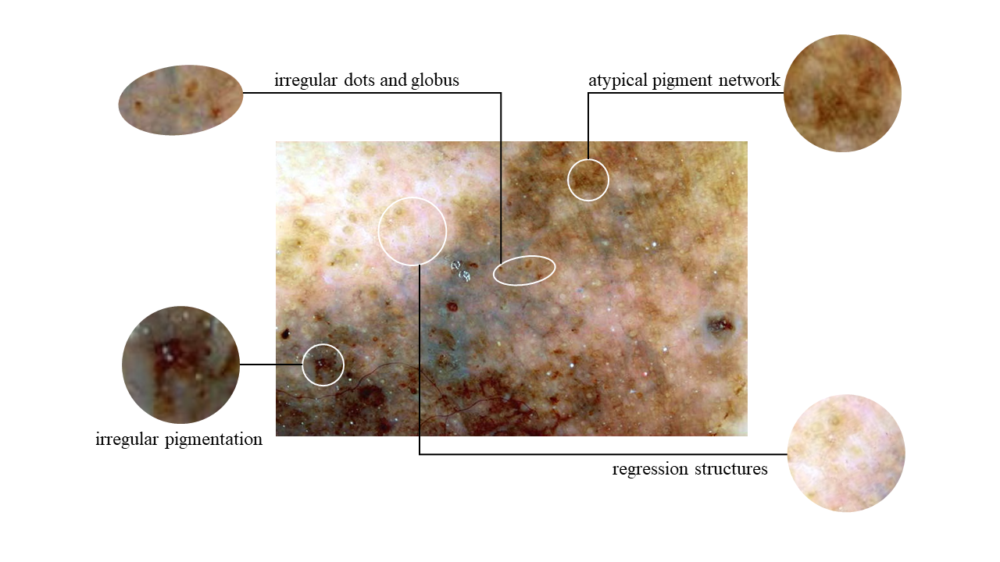

# 7PGD
This is the repo for paper "Improving Melanoma Detection Through Clinical Knowledge-Based Topological Graphs and Data-Driven Quantification Standards"

  
  
  

  

## Abstract
The 7-point checklist (7PCL) is widely used in dermoscopy to identify malignant melanoma lesions needing urgent medical attention. It assigns point values to seven attributes: major attributes are worth two points each, and minor ones are worth one point each. A total score of three or higher prompts further evaluation, often including a biopsy. However, a significant limitation of current methods is the uniform weighting of attributes, which leads to imprecision and neglects their interconnections. Previous deep learning studies have treated the prediction of each attribute with the same importance as predicting melanoma, which fails to recognize the clinical significance of the attributes for melanoma. To address these limitations, we introduce a novel diagnostic method that integrates two innovative elements: a Clinical Knowledge-Based Topological Graph (CKTG) and a Gradient Diagnostic Strategy with Data-Driven Weighting Standards (GD-DDW). The CKTG integrates 7PCL attributes with diagnostic information, revealing both internal and external associations. By employing adaptive receptive domains and weighted edges, we establish connections among melanoma's relevant features. Concurrently, GD-DDW emulates dermatologists' diagnostic processes, who first observe the visual characteristics associated with melanoma and then make predictions. Our model uses two imaging modalities for the same lesion, ensuring comprehensive feature acquisition. Our method shows outstanding performance in predicting malignant melanoma and its features, achieving an average AUC value of 85%. This was validated on the EDRA dataset, the largest publicly available dataset for the 7-point checklist algorithm. Specifically, the integrated weighting system can provide clinicians with valuable data-driven benchmarks for their evaluations.

## Setup
1. compile the docker file
> cd docker

> docker build -t 7pgd .

2. config the script and create docker container

> docker create --name <container_name> -it \
                --shm-size=32G \
                -p 6006:6006 \
                -p 8080:8080 \
                -e DISPLAY=unix$DISPLAY \
                -e GDK_SCALE \
                -e GDK_DPI_SCALE \
                -v /dev/video0:/dev/video0 \
                -v /dev/video1:/dev/video1 \
                -v /tmp/.X11-unix:/tmp/.X11-unix \
                -v <proj_path>:/root/code \
                -v /mnt/f/datasets:/root/data \
                --gpus all \
                <docker_image> \
                /bin/zsh
 
## Citation

## License
This repository is licensed under the MIT License. See the LICENSE file for details.

## Acknowledgements
Acknowledge any funding sources, contributors, or other relevant parties.

## Contact
For any questions or issues, please contact First Author or open an issue in this repository.
