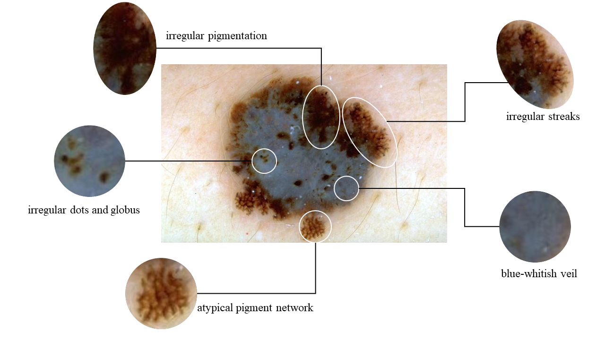
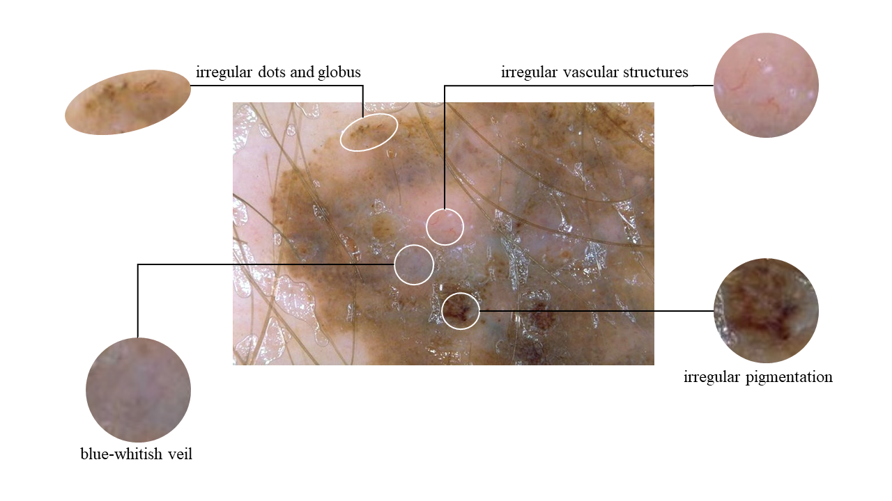
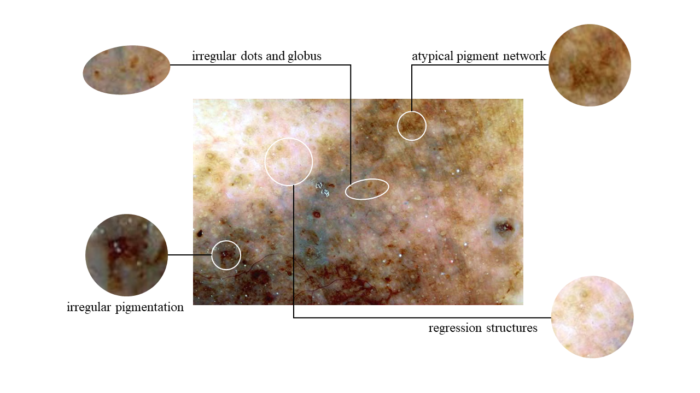
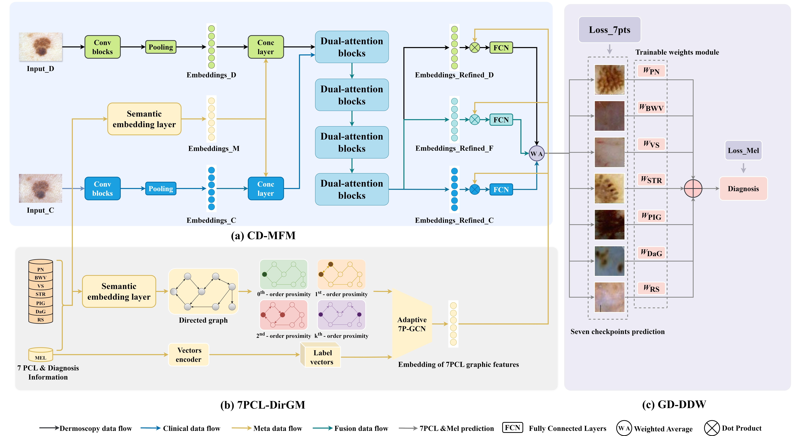

# 7PGD
This is the repo for paper "Incorporating Clinical Knowledge Graphs to Deep Learning-Based 7PCL for Melanoma Detection from Multiple Skin Lesions"

  
  
  

  

## Abstract
The 7-point checklist (7PCL) is a widely used diagnostic tool in dermoscopy for identifying malignant melanoma by assigning point values to seven specific attributes. However, the traditional 7PCL is limited to distinguishing between malignant melanoma and melanocytic nevi, and falls short in scenarios where multiple skin diseases with appearances similar to melanoma coexist. To address this limitation, we propose a novel diagnostic framework that integrates a clinical knowledge-based topological graph (CKTG) with a gradient diagnostic strategy featuring a data-driven weighting system (GD-DDW). The CKTG captures both the internal and external relationships among the 7PCL attributes, while the GD-DDW emulates dermatologists' diagnostic processes, prioritizing visual observation before making predictions. Additionally, we introduce a multimodal feature extraction approach leveraging a dual-attention mechanism to enhance feature extraction through cross-modal interaction and unimodal collaboration. This method incorporates meta-information to uncover interactions between clinical data and image features, ensuring more accurate and robust predictions. Our approach, evaluated on the EDRA dataset, achieved an average AUC of 88.6\%, demonstrating superior performance in melanoma detection and feature prediction. This integrated system provides data-driven benchmarks for clinicians, significantly enhancing the precision of melanoma diagnosis. 

## Setup
1. compile the docker file
> cd docker

> docker build -t 7pgd .

2. config the script and create docker container

> docker create --name <container_name> -it \
                --shm-size=32G \
                -p 6006:6006 \
                -p 8080:8080 \
                -e DISPLAY=unix$DISPLAY \
                -e GDK_SCALE \
                -e GDK_DPI_SCALE \
                -v /dev/video0:/dev/video0 \
                -v /dev/video1:/dev/video1 \
                -v /tmp/.X11-unix:/tmp/.X11-unix \
                -v <proj_path>:/root/code \
                -v /mnt/f/datasets:/root/data \
                --gpus all \
                <docker_image> \
                /bin/zsh
 
## Citation

## License
This repository is licensed under the MIT License. See the LICENSE file for details.

## Acknowledgements
Acknowledge any funding sources, contributors, or other relevant parties.

## Contact
For any questions or issues, please contact First Author or open an issue in this repository.
